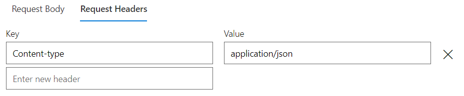

# Hvordan legge til Inmeta Schema Extension i MS Graph

1.  Gå til Graph Explorer (logget inn med Uninett-bruker)  

2.  Kjør følgende GET-request:  
`https://graph.microsoft.com/v1.0/schemaExtensions?$filter=id eq 'extvcs569it_InmetaGenericSchema'`  

3.  Kopier alt under "value"-bracketen i **Response Preview**  

4.  Gå til Graph Explorer (logget inn med test-tenant-bruker)  

5.  Lag en POST-request til:   
`https://graph.microsoft.com/v1.0/schemaExtensions`  

6. Lim det du kopierte fra Uninett-Graphen inn i **Request Body**  

7. Lag en **Request Header** med key "Content-type" og value "application/json"  

8.  Trykk på **Run Query** for å opprette schema extensionen  

9.  Dobbeltsjekk at extensionen ble opprettet ved å kjøre den samme GET-requesten som vi gjorde tidligere:  
`https://graph.microsoft.com/v1.0/schemaExtensions?$filter=id eq 'extvcs569it_InmetaGenericSchema'`