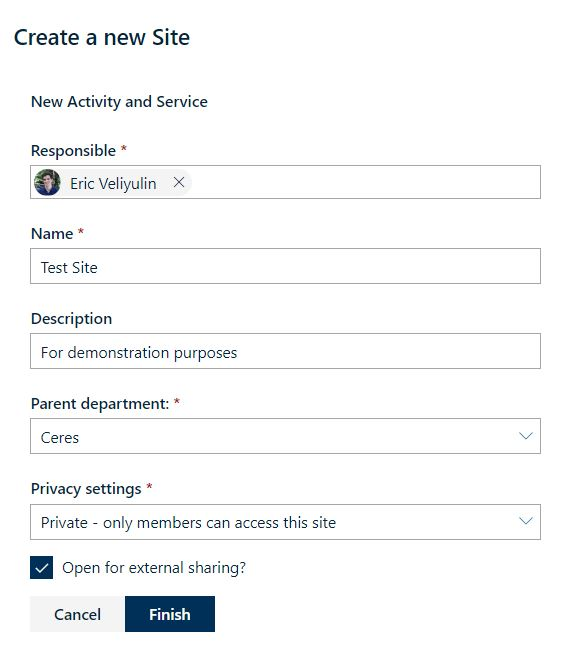

# Site Directory

Displays SharePoint sites from your Office 365 tenant in a customised [DetailsList](https://developer.microsoft.com/en-us/fabric#/controls/web/detailslist) component.  

New sites can be created using the [Order Site Button](#order-site-button) web part.

  

## Features

- Sort columns by clicking on their header
- Apply filters to narrow down search
- Each site has a context menu with links to Planner, Email and Calendar

## Properties

- **List rows per page:**  
Decide how many rows to display on one page
- **Show New button:**  
Display New button in toolbar, allowing users to create new sites
- **Hide Department column:**  
Toggle visibility of Department column
- **Site types:**  
A comma separated list of possible site types (e.g. Aktivitet,Seksjon,Prosjekt)
- **Search settings:**  
Toggle between Graph filter search and Javascript search

# Order Site Button

Lets you order a new, customised SharePoint site.

 | 
--- | ---

## Features

- Select one of three different site types depending on your needs:  
    Activity and Service, Department, or Project
- Each site type lets you adjust different kinds of settings to customise your site
- After manual review by an administrator, an Azure Logic App automatically creates the ordered SharePoint site

## Properties

- **"Avdeling" site type name:**  
Select whether to display "Avdeling/Department" or "Seksjon/Section"
- **Hide "Parent department" field:**  
Toggle wether to show the "Parent department" field or not

## I've ordered a site, now what?

1. After ordering a site, it will appear in the "Bestillinger" list of your tenant with the status set to *Ordered*.  
2. An administrator must then review the ordered site and set its status to *Create* if it complies with the guidelines for site creation.  
3. An Azure Logic App polls the "Bestillinger" list frequently, and automatically creates any site with the status set to *Create*. After the site is created, its status will be set to *Completed*, and you will receive an email confirming the success of your site order.
