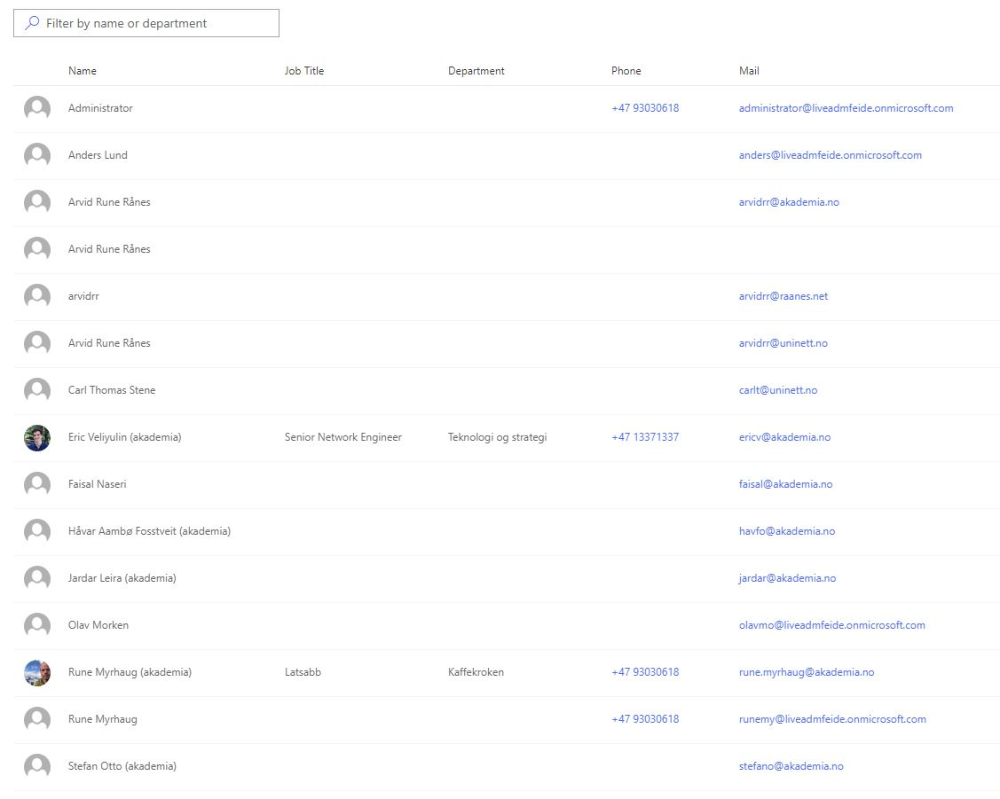

# User Directory

Displays users from your Office 365 tenant in a customised [DetailsList](https://developer.microsoft.com/en-us/fabric#/controls/web/detailslist) component.  

The web part uses MS Graph REST API to retrieve Office 365 users from Azure AD.  
Using either the built-in search box or the [Search Box](#search-box) web part, you can filter users by name or department.

## Features

- Sort columns by clicking on their header
- Select which columns to display
- Create custom column headers
- Resize columns
- Customise the visual presentation of the results

## Properties

- **API:**  
The MS Graph query for the group of users you want to display (e.g. *users* for all users, or *groups/{group_ID}/members* for users in a specific group). If you want to retrieve more than 100 users, add *?$top=999* at the end of the query.
- **Compact mode:**  
Toggle between compact and normal row spacing.
- **Row colour:**  
Toggle between single row colour (white) and alternating row colours (blue and white).
- **Search box source:**  
Toggle between using the built-in search box and the Search Box web part. If you want to use the Search Box web part, simply add it to the page and it will automatically connect to the User Directory.
  - **Placeholder text:**  
  Specify the placeholder text that is shown when the search box is empty (for built-in search box).
- **Select columns:**  
Use the checkboxes to select the columns you want to display in the User Directory.
- **Custom column headers:**  
Lets you create custom column headers. Leave the fields blank to use the default column headers.

# Search Box

Simply add this to a page with a User Directory on it to be able to search through the directory.

This web part uses the [ReactiveX (RxJs)](http://reactivex.io/) library to allow communication between the two web parts.  
Its functions are identical to the built-in search box of User Directory.

## Properties

- **Placeholder text:**  
Specify the placeholder text that is shown when the search box is empty.

