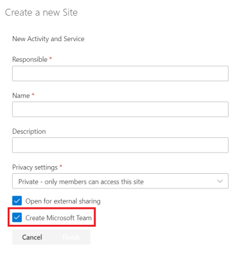

# Automatic creation of Team when ordering Site
This branch has an updated version of the **Order Site Button** Web part, which now includes a checkbox that allows the user to automatically create a Microsoft Team.

All of the Web part logic, as well as the Azure Logic App, has been implemented, and the only work that remains is to make the Azure Function app function properly.

In order to be able to create a Team programmatically in C#, the Microsoft.Graph package had to be updated to the latest version. This has caused many compatibility issues with existing code, and I have not managed to resolve all of these issues as of yet. The exact functions that are causing problems are the [ApplySiteTemplate](Azure.Functions/ApplySiteTemplate.cs) and the [CreateOfficeGroup](Azure.Functions/CreateOfficeGroup.cs) functions.
