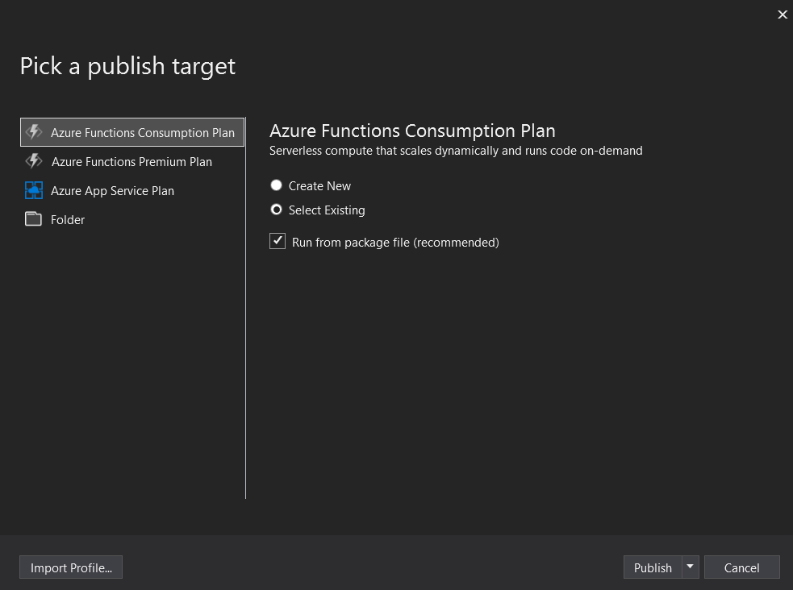
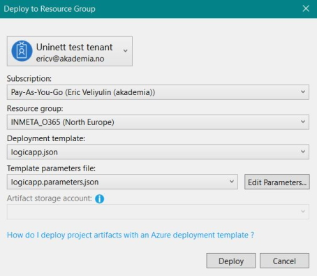
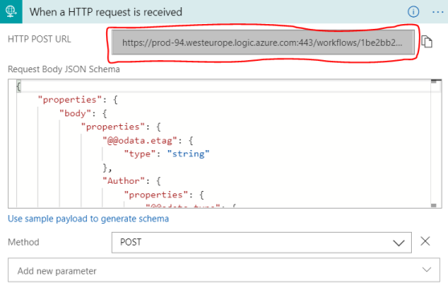

# Site Directory documentation

## Permissions

1. Create a new Office 365 user account with the following settings:
   - **Name**: o365@\<yourtenant>.onmicrosoft.com
   - **Roles**: SharePoint administrator
   - Assign the following licenses:
     - Exchange Online
     - Office 365
2. In your SharePoint Site Collection, assign the **Owner** role (Full control) to the new user
3. In the Azure Portal, assign the **Application administrator** role to the new user

## Create SharePoint and Azure Apps

### Register SP app

1. Log into the SharePoint admin center with the user created in the previous step
2. Go to https://yourtenant-admin.sharepoint.com/_layouts/15/AppRegNew.aspx
3. Generate a Client Id and Client Secret (*make sure to write these down!*)
4. Set the **Title** to "provengineapp"
5. App Domain and Redirect URI are not important, so just copy the example values
6. Click **Create**
   
   


### Configure SP app

1. Go to https://yourtenant-admin.sharepoint.com/_layouts/15/AppInv.aspx
2. Paste the Client Id from the provengineapp into the **App Id** field and click **Lookup**
3. Copy and paste the following snippet into the **Permission Request XML** field:
    ```
    <AppPermissionRequests AllowAppOnlyPolicy="true">
        <AppPermissionRequest Scope="http://sharepoint/content/tenant" Right="FullControl" />
    </AppPermissionRequests>
    ```
4. Click **Create**
5. Click **Trust It** when asked to to trust provengineapp
   
   

### Register AD App

1. Go to https://portal.azure.com (still logged in as the new o365 user)
2. Go to Azure Active Directory -> App registrations and click **New registration**
3. Set the following settings and click **Register**:
    - **Name**: ProvisioningEngine
    - **Supported account types**: Accounts in any organizational directory (Any Azure AD directory - Multitenant) and personal Microsoft accounts (e.g. Skype, Xbox)
    - **Redirect URI**: `http://localhost`
4. Go to **Authentication** in your new Azure App and change these settings:
    - **Live SDK support**: No
    - **Default client type**: Yes
5. Go to **Certificates & secrets** and click **New client secret**.  
   Set the expiration to "Never" and click **Add**.  
   *Make sure to write down the new client secret!*
6. Go to **API permissions** and add the following MS Graph permissions:
   - Directory.ReadWrite.All
   - Group.ReadWrite.All
   - User.Read.All
  
7. After adding the permissions, click **Grant admin consent for \<Your Tenant>**
8. While you are in your new Azure App, make note of its **Application (client) ID**, which is found in the Overview tab

## PowerShell scripts

### Deploy SharePoint List

1. Open PowerShell ISE.  
   Make sure you have the *sharepoint-pnp* module installed.

2. Navigate to the PnP.SiteDirectory project
3. Connect to your Site Collection:
   ```
   Connect-PnPOnline -Url <sitecollectionurl> -UseWebLogin
   ```
4. Log in with the o365 user
5. Deploy the project:
   ```
   ApplyPnPProvisioningTemplate -Path ./RootTemplate.Uninett.xml
   ```

6. A new SharePoint List called "Bestillinger" can now be found at your Site Collection URL + `/Lists/bestillinger`.  
   This is the list that will receive and contain all the site orders generated by the Order Site Button web part.
   
7. Go to the newly created list, click on the gear icon and select **List settings**.
8. Find the List ID in the URL and write down its value.   
   To find the ID, take the string that follows "List=" at the end of the URL, and strip away "%7B" from the start and "%7D" from the end of the string.  
   For example, using the following URL:
   ```
   https://contoso.sharepoint.com/sites/Company/_layouts/15/listedit.aspx?List=%7B29885d20-4a96-438d-9eb2-025148cefbd0%7D
   ```
   we see that the List ID is `29885d20-4a96-438d-9eb2-025148cefbd0`.

### Deploy themes

1. Open PowerShell
   
2. Navigate to the PS.Scripts project
3. Run: 
   ```
   . .\KDTODesign.ps1
   ```
4. Enter your tenant name (without *.sharepoint.com* suffix)
5. Log in with the o365 user

## Edit source files

### local.settings.json

1. Open KDTO.sln in Visual Studio 2019
   
2. Navigate to the Azure.Functions project and make a copy of the **TEMPLATE.local.settings.json** file.  
   Call the new file **local.settings.json**

3. Open the newly created **local.settings.json** file and edit the following fields:
   - **AADClientId**: the Application ID of the ProvisioningEngine Azure app
   - **AADClientSecret**: the Client Secret of the ProvisioningEngine Azure app
   - **AADDomain**: the name of your Azure domain (e.g. contoso.onmicrosoft.com)
   - **SPClientId**: the Application ID of the provengineapp SharePoint app
   - **SPClientSecret**: the Client Secret of the provengineapp SharePoint app
   - **SPUserId**: the o365@\<yourtenant>.onmicrosoft.com user created at the beginning of this tutorial
   - **SPUserPassword**: the user's password
   - **SPGroupsSiteUrl**: the root site of your Site Collection
   - **TenantAdminUrl**: the URL of your tenant's SharePoint admin center

4. Save and close the file


### LogicApp.parameters.json

1. Navigate to the Azure.Functions project and make a copy of the **TEMPLATE.LogicApp.parameters.json** file.  
   Call the new file **LogicApp.parameters.json**

2. Open the newly created **LogicApp.parameters.json** file and make the following changes:  
   - Edit all the fields that contain *\<YourTenant>* or *\<yourtenant>* by replacing the value with the name of your tenant
   - Change **siteOrderUrl** to the root site of your Site Collection
   - Change **orderListId** to the List ID of your Bestillinger list
   - (Optional) Change **emailRecipient** to another account if you want status emails to be sent to a different address than the o365 user
   - Change all of the appSettings values at the end of the file to be the same as those in the local.settings.json file

3. Save and close the file

## Deployment

### Create new Resource Group

Start by creating a new Resource Group in your Azure Subscription.

### Create Function App

Create a new Function App in the Resource Group with the following settings:
- **App name**: \<YourTenantName>SiteProvEngine (e.g. *ContosoSiteProvEngine*)
- **OS**: Windows
- **Hosting Plan**: Consumption Plan
- **Location**: same as your Resource Group
- **Runtime Stack**: .NET Core
- **Storage**: Create new -> \<yourtenantname>siteprovengine (e.g. *contosositeprovengine*)
  
### Publish Function Apps

1. Open KDTO.sln in Visual Studio 2019
2. Connect your Azure subscription to Visual Studio and log in with the o365 user
3. Right-click the Azure.Functions project and select **Build**
4. Right-click the Azure.Functions project and select **Publish**
5. Pick **Azure Functions Consumption Plan** as a publish target
6. Choose "Select Existing" (check "Run from package file") and click **Publish**  
      
   

7. Select the *SiteProvEngine* Function App in your Resource Group and click **OK**

### Deploy Logic Apps

1. Right-click the Azure.Resources project and select **Build**
   
2. Right-click the Azure.Resources project and select **Deploy** -> **New**
3. Make sure the deployment settings are as follows:
   - **Deployment template**: logicapp.json
   - **Template parameters files**: logicapp.parameters.json
 
   

4. Click **Deploy**

Now that everything has been deployed, you should see the following items in your Resource group in Azure (replace *Contoso* with your tenant):
- contosositeprovengine (Storage account)
- ContosoSiteProvEngine (App Service)
- ContosoProvEngineFlow (Logic app)
- ContosoProvEngineTrigger (Logic app)
- NorthEuropePlan (App Service plan)
- office365 (API Connection)
- sharepointonline (API Connection)

## Final steps

### Authenticate APIs in Azure Portal

1. Go to the **office365** API Connection in your Resource group
   
2. You will be notified that "This connection is not authenticated".  
   Click on the message, and proceed to authenticate by logging in using the o365 user.
3. Repeat the exact same steps for the **sharepointonline** API Connection

### Get flowUrl value

There is one value in the *LogicApp.parameters.json* file we haven't touched yet, which is the flowUrl value. This value gets automatically generated during the deployment of the Logic apps, and we can now find it and add it to our parameters file.

1. Go to the **YourTenantProvEngineFlow** Logic app in your Resource group, and open the **Logic app designer**
   
2. Expand the very first step of the flow (*When a HTTP request is received*)
3. Copy the value from **HTTP POST URL**.  
   This is the flowUrl that we are after



4. Replace the **flowUrl** value in *LogicApp.parameters.json* with the copied value

5. Save the file
6. Re-build the Azure.Resources project
7. Re-deploy the Azure.Resources project