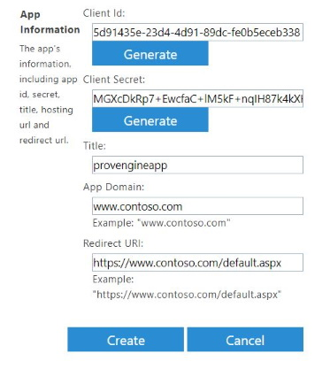
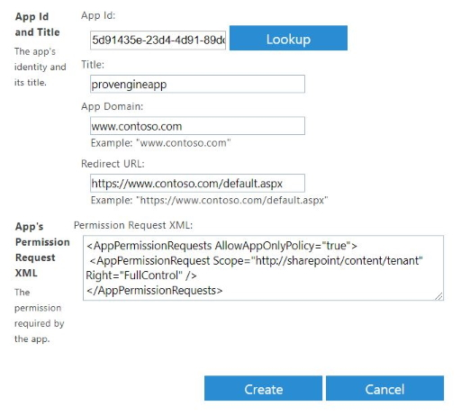

# Order Site documentation

## Permissions

1. Create a new Office 365 user account with the following settings:
   - **Name**: o365@\<yourtenant>.onmicrosoft.com
   - **Roles**: SharePoint administrator
   - Assign the following licenses:
     - Exchange Online
     - Office 365
3. In your SharePoint Site Collection, assign the **Owner** role (Full control) to the new user
4. In the Azure Portal, assign the **Application administrator** role to the new user

## Create SharePoint and Azure Apps

### Register SP app

1. Log into the SharePoint admin center with the user created in the previous step
2. Go to https://yourtenant-admin.sharepoint.com/_layouts/15/AppRegNew.aspx
3. Generate a Client Id and Client Secret (*make sure to write these down!*)
4. Set the **Title** to "provengineapp"
5. App Domain and Redirect URI are not important, so just copy the example values
6. Click **Create**
   
   


### Configure SP app

1. Go to https://yourtenant-admin.sharepoint.com/_layouts/15/AppInv.aspx
2. Paste the Client Id from the provengineapp into the **App Id** field and click **Lookup**
3. Copy and paste the following snippet into the **Permission Request XML** field:
    ```
    <AppPermissionRequests AllowAppOnlyPolicy="true">
        <AppPermissionRequest Scope="http://sharepoint/content/tenant" Right="FullControl" />
    </AppPermissionRequests>
    ```
4. Click **Create**
5. Click **Trust It** when asked to to trust provengineapp
   
   

### Register AD App

1. Go to https://portal.azure.com (still logged in as the new o365 user)
2. Go to Azure Active Directory -> App registrations and click **New registration**
3. Set the following settings and click **Register**:
    - **Name**: ProvisioningEngine
    - **Supported account types**: Accounts in any organizational directory (Any Azure AD directory - Multitenant) and personal Microsoft accounts (e.g. Skype, Xbox)
    - **Redirect URI**: `http://localhost`
4. Go to **Authentication** in your new Azure App and change these settings:
    - **Live SDK support**: No
    - **Default client type**: Yes
5. Go to **Certificates & secrets** and click **New client secret**.  
   Set the expiration to "Never" and click **Add**.  
   *Make sure to write down the new client secret!*
6. Go to **API permissions** and add the following MS Graph permissions:
   - Directory.ReadWrite.All
   - Group.ReadWrite.All
   - User.Read.All
  
7. After adding the permissions, click **Grant admin consent for \<Your Tenant>**
8. While you are in your new Azure App, make note of its **Application (client) ID**, which is found on the Overview tab


## Edit source files

### local.settings.json

1. Open KDTO.sln in Visual Studio 2019
   
2. Navigate to the Azure.Functions project and make a copy of the **TEMPLATE.local.settings.json** file.  
   Call the new file **local.settings.json**

3. Open the newly created **local.settings.json** file and edit the following fields:
   - **AADClientId**: the Application ID of the ProvisioningEngine Azure app
   - **AADClientSecret**: the Client Secret of the ProvisioningEngine Azure app
   - **AADDomain**: the name of your Azure domain (e.g. contoso.onmicrosoft.com)
   - **SPClientId**: the Application ID of the provengineapp SharePoint app
   - **SPClientSecret**: the Client Secret of the provengineapp SharePoint app
   - **SPUserId**: the o365@\<yourtenant>.onmicrosoft.com user created at the beginning of this tutorial
   - **SPUserPassword**: the user's password
   - **SPGroupsSiteUrl**: the root site of your Site Collection
   - **TenantAdminUrl**: the URL of your tenant's SharePoint admin center

4. Save and close the file


### LogicApp.parameters.json

1. Navigate to the Azure.Functions project and make a copy of the **TEMPLATE.LogicApp.parameters.json** file.  
   Call the new file **LogicApp.parameters.json**

2. Open the newly created **LogicApp.parameters.json** file and edit the following fields:
   - **AADClientId**: the Application ID of the ProvisioningEngine Azure app
   - **AADClientSecret**: the Client Secret of the ProvisioningEngine Azure app
   - **AADDomain**: the name of your Azure domain (e.g. contoso.onmicrosoft.com)
   - **SPClientId**: the Application ID of the provengineapp SharePoint app
   - **SPClientSecret**: the Client Secret of the provengineapp SharePoint app
   - **SPUserId**: the o365@\<yourtenant>.onmicrosoft.com user created at the beginning of this tutorial
   - **SPUserPassword**: the user's password
   - **SPGroupsSiteUrl**: the root site of your Site Collection
   - **TenantAdminUrl**: the URL of your tenant's SharePoint admin center

3. Save and close the file

## Deployment

### Create new Resource Group

Start by creating a new Resource Group in your Azure Subscription.

### Create Function App

Create a new Function App in the Resource Group with the following settings:
- **App name**: \<YourTenantName>SiteProvEngine (e.g. *ContosoSiteProvEngine*)
- **OS**: Windows
- **Hosting Plan**: Consumption Plan
- **Location**: same as your Resource Group
- **Runtime Stack**: .NET Core
- **Storage**: Create new -> \<yourtenantname>siteprovengine (e.g. *contosositeprovengine*)
  
### Publish Function Apps

1. Open *KDTO.sln* in Visual Studio 2019
2. Right click the Azure.Functions project -> **Build**
3. Right click the Azure.Functions project -> **Publish**
4. Pick **Azure Functions Consumption Plan** as a publish target
5. Choose "Select Existing" (check "Run from package file") -> click **Publish**  
      
   

6. Select the *SiteProvEngine* Function App in your Resource Group -> **OK**
7. Follow the above steps for the Azure.ApplyPowershell project, but publish it to the *ApplyPowershell* Function App instead.

### Deploy Logic Apps

## Permissions

- A user needs read/write permissions on the *Bestillinger* list to be able to use the Order Site web part.
- You need a user with the Owner role of the SharePoint Site Collection you wish to deploy the solution to.  
  This user also needs read/write permissions on the *Bestillinger* list.
- In order for the provisioning engine to be able to send status emails, it needs to be authenticated with an Office 365 user account that has an Exchange Online license.  
  This is the `emailRecipient` parameter in LogicApp.parameters.json.