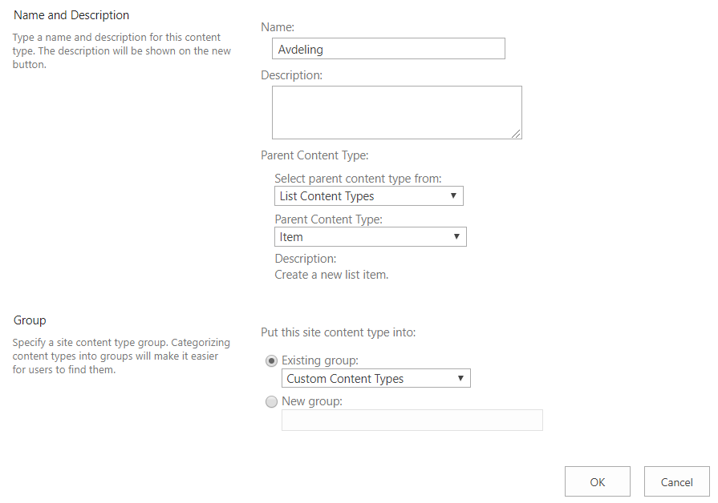
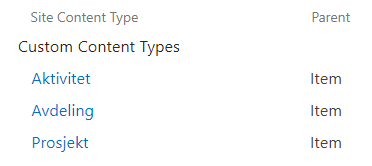
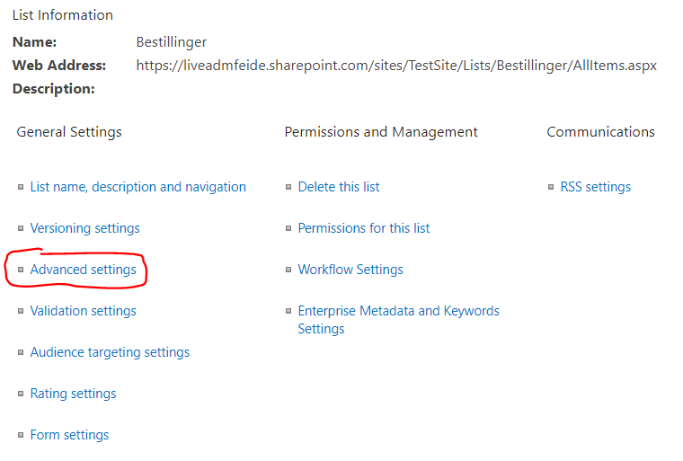
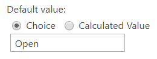
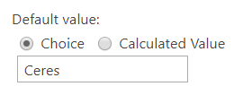
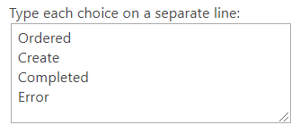

## Opprett Site Content Types

Før vi oppretter listen må vi definere noen nye Site Content Types: en for Avdeling, en for Aktivitet og Tjeneste, og en for Prosjekt.

 1. Gå til **Site Contents > Site settings > Site content types** og trykk på **Create**.  

 
 2. Skriv "Avdeling" under **Name**, og velg "List Content Types" og "Item" under **Parent Content Type**. Pass på at *Custom Content Types* er valgt som **Group**.  
Avslutt med å trykke **OK**.  

 3.  Gjenta forrige steg to ganger, bare med "Aktivitet" og deretter "Prosjekt" som **Name**.  
 

Du vil nå kunne se at Content Types'ene ligger under **Custom Content Types** på Site Content Types-siden.

## Opprett og tilpass liste

 1.  Gå til **Site Contents** og naviger til den mappen du ønsker å opprette listen i, og trykk deretter på **+ New > List**.
 
 2.  Skriv "Bestillinger" under **Name**. Du kan selv velge om du vil legge til en beskrivelse, og om listen skal vises i navigasjonspanelet. Opprett listen ved å trykke på **Create**.  
 
 
 3.  Nå som listen er opprettet, kan du begynne å tilpasse den.
Trykk på tannhjulet øverst til høyre, og velg deretter **List settings**.  

 4. Gå inn på **Advanced settings** på innstillingssiden.  
 
 
<ol start=5>
	<li>Endre på følgende innstillinger:</li>
	<ol type="a">
		<li></li>
		<li></li>
		<li></li>
	</ol>
	Bekreft med <b>OK</b>.	
</ol>

Du skal nå kunne legge til de egendefinerte Site Content Types'ene vi opprettet tidligere. Før vi gjør 	det, oppretter vi noen nye Columns.

## Opprett Columns

Bla deg ned til Columns-overskriften på innstillingssiden og trykk på **Create column**.  
Vi skal nå opprette 15 nye Columns, og du må trykke på **Create column** for hver av dem. Du får opplyst navnet på kolonnen, typen informasjon kolonnen skal inneholde, samt ytterligere innstillinger som må endres på.  
Hvert steg representerer opprettelsen av én kolonne.

1.  **Column name:** Description  
	**Type:** Multiple lines of text  
	**Specify the type of text to allow:** Plain text  

2.  **Column name:** End date  
**Type:** Date and Time  
**Default value:** Today's Date  

3.  **Column name:** External sharing  
**Type:** Yes/No (check box)  
**Default value:** No  

4.  **Column name:** Open/Closed  
**Type:** Choice (menu to choose from)  
**Description:** "Lukkede områder er kun tilgjengelige for eiere og medlemmer av gruppen. Åpne er synlige og tilgjengelige for alle."  
**Type each choice on a separate line:** 
 
**Default value:**  

5.  **Column name:** Owner  
**Type:** Person or Group  

6.  **Column name:** Owning department  
**Type:** Managed Metadata  
**Term Set Settings:**  

7. **Column name:** Parent department  
**Type:** Choice (menu to choose from)  
**Type each choice on a separate line:**  
  
**Default value:**  

8.  **Column name:** Prefered URL  
**Type:** Single line of text  

9.  **Column name:** Project goal  
**Type:** Single line of text  

10.  **Column name:** Project number  
**Type:** Single line of text  

11.  **Column name:** Project purpose  
**Type:** Multiple lines of text  
**Specify the type of text to allow:** Plain text  

12.  **Column name:** Short name  
**Type:** Single line of text  

13.  **Column name:** Sign-off status  
**Type:** Single line of text  

14.  **Column name:** Start date  
    **Type:** Date and Time  
    **Default value:** Today's Date  

15.  **Column name:** Status
**Type:** Choice (menu to choose from)  
**Type each choice on a separate line:**  
  
**Default value:**  

Nå er alle de nødvendige kolonnene opprettet. Sammenlign kolonnene på innstillingssiden din med følgende skjermbilde og forsikre deg om at du ikke har hoppet over et steg.

## Legg til Content Types

Neste steg er å legge til Content Types.

1.  Trykk på **Add from existing content types** på innstillingssiden.

2.  Velg de tre Content Types'ene du har laget og trykk på **Add >**.  
Du vil nå kunne se dem under Content Types-overskriften på innstillingssiden:

3.  Trykk på **Avdeling**, og deretter **Add from existing site or list columns** under Columns-overskriften.

4.  Velg følgende kolonner, og trykk **Add >**. Fullfør med å trykke på **OK**.

5. Nå må du endre kolonnestatusen til Title- og Owner-kolonnene. Trykk på tittelen til hver av kolonnene, og sett Title til **Optional** og Owner til **Required**.

6. Gå tilbake til hovedinnstillingssiden, og velg deretter **Aktivitet**.  
    Trykk igjen på **Add from existing site or list columns** under Columns-overskriften.
    
7.  Her velger du akkurat de samme kolonnene som for Avdeling, minus *Short name*. Fullfør med å trykke på **OK**.

8. Endre kolonnestatusen til Owner-kolonnen til **Required**.

9.  Gå tilbake til hovedinnstillingssiden, og velg til slutt **Prosjekt**.  
    Trykk igjen på **Add from existing site or list columns** under Columns-overskriften.
    
10.  Legg til alle de tilgjengelige kolonnene, bortsett fra *Description* og *Short name*. Fullfør med å trykke på **OK**.

11. Endre kolonnestatusen til Owner-kolonnen til **Required**.

## Opprett View

1.  Bla deg ned til bunnen av hovedinnstillingssiden, og trykk på **Create view**.

2.  På neste side velger du **All Items** under *Start from an existing view*.

3. Gi Viewen navnet "Alle bestillinger", og huk av for **Make this the default view**.  
Forsikre deg om at View Audience er satt til **Create a Public View**.

4. Huk av for kun **Title**, **Content Type**, **Status** og **Sign-off status**, og endre **Position from Left** til å være likt skjermbildet nedenfor.

5. Endre deretter på innstillingene under **Sort** til å være likt skjermbildet nedenfor.

6. Huk til slutt av for **Enable this view for mobile access** under **Mobile**, og trykk på **OK** for å fullføre.